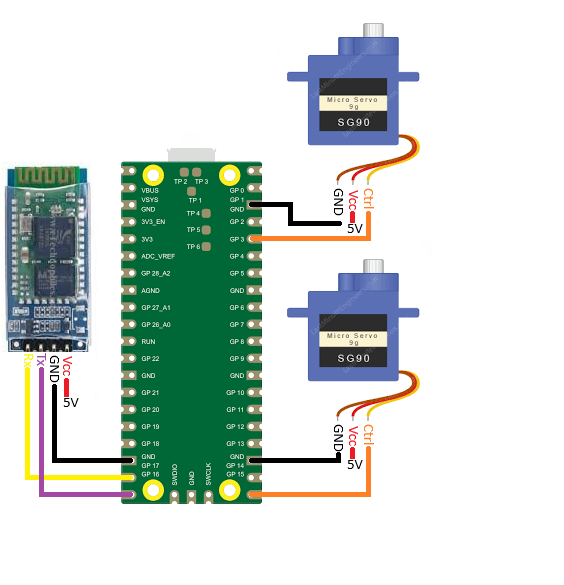
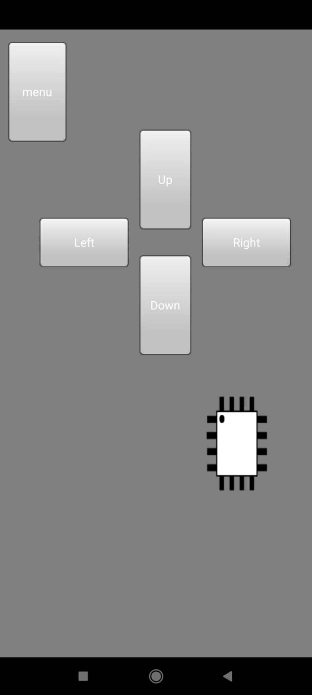
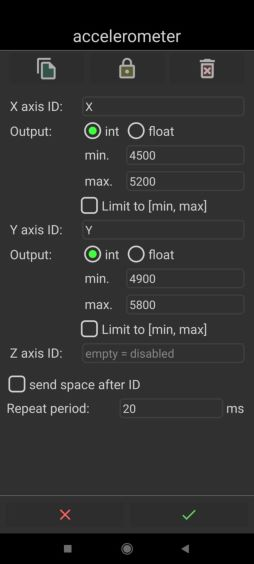

# Dokumentacja Labyrinth

## Spis Treści
1. [Cel Projektu](#cel-projektu)
2. [Wykorzystane komponenty](#wykorzystane-komponenty)
   - [Raspberry Pi Pico](#raspberry-pi-pico)
   - [HC-06](#hc-06)
   - [SG90](#sg90)
   - [SG90-HV](#sg90-hv)
3. [Schemat połączeń](#schemat-polaczen)
4. [Software](#Software)
   - [Aplikacja ze sterowaniem przyciskami](#aplikacja-z-przyciskami)
   - [Aplikacja ze sterowaniem akcelerometrem](#aplikacja-z-akcelerometrem)
   -[Aplikacja na telefon](#aplikacja-na-telefon)
   

## Cel Projektu
Celem projektu jest stworzenie gry w stylu mini-golfa, polegającej na umieszczeniu kuli w centralnym miejscu planszy poprzez odpowiednie omijanie przeszkód.

## Wykorzystane komponenty
Spis oraz opis komponentów niezbędnych do realizacji projektu gry "Labyrinth".

### Raspberry Pi Pico
W projekcie użyto mikrokontrolera Raspberry Pi Pico:
Odbiera dane z aplikacji i steruje pochyleniem planszy za pomocą dwóch serwomechanizmów. UART0 służy do odbierania danych z modułu HC-06, a sygnały PWM sterują serwami SG90 i SG90-HV odpowiednio do ruchów pionowych i poziomych.

### HC-06
Moduł Bluetooth umożliwia komunikację pomiędzy układami master i slave. Zasilany jest zewnętrznym źródłem 5V i podłączony w następujący sposób:
- **Rx**: GP17
- **Tx**: GP16
- **GND**: GND
- **Vcc**: Zewnętrzne źródło 5V

### SG90
Serwomechanizm użyty do pochylania planszy w pionie. Zasilany jest zewnętrznym źródłem 5V i podłączony w następujący sposób:
- **Pin sterujący**: GP3
- **Vcc**: Zewnętrzne źródło 5V
- **GND**: GND

### SG90-HV
Serwomechanizm użyty do pochylania planszy w poziomie. Zasilany jest zewnętrznym źródłem 5V i podłączony w następujący sposób:
- **Pin sterujący**: GP15
- **Vcc**: Zewnętrzne źródło 5V
- **GND**: GND

### Schemat połączeń układu 

**Moduł Bluetooth HC-06:**
- Rx → GP17
- Tx → GP16
- GND → GND
- Vcc → Zewnętrzne źródło 5V
  
**Serwomechanizm SG90:**
- GND → GND
- Vcc → Zewnętrzne źródło 5V
- Pin sterujący → GP3

**Serwomechanizm SG90-HV:**
- GND → GND
- Vcc → Zewnętrzne źródło 5V
- Pin sterujący → GP15

## Software

### Aplikacja z przyciskami 
      - zaimportowanie modułów (część wspólna aplikacji)
      from machine import UART, Pin, PWM
      import time
      
      --- Ustawienia peryferii --- (część wspólna aplikacji)
      - UART
      TXPIN = 16
      RXPIN = 17
      UARTNUM = 0
      BAUDRATE = 9600
      
      - PWM
      XPWM = PWM(Pin(15))
      YPWM = PWM(Pin(3))
      XPWM.freq(50)
      YPWM.freq(50)
      
      - Zakresy ruchu silników
      YMAX = 5800
      YMID = 5000
      YMIN = 4900
      YCURRENT = YMID
      
      XRIGHT = 5200
      XSTOP = 4800
      XLEFT = 4510

      def bts(data):
          """Dekoduje dane z formatu bajtowego na UTF-8."""
          if isinstance(data, bytes):
              return data.decode('utf-8')
          else:
              raise ValueError("Błąd konwersji")
      
      def detect_command(uart):
          """Wykrywa i dekoduje komendy przesłane przez UART."""
          if uart.any():
              received = uart.read()
              if received:
                  return bts(received).strip()
          return ""
      
       --- Funkcja główna ---

      def main():
          print("Startowanie...")
      
         - Inicjalizacja UART
          uart = UART(UARTNUM, BAUDRATE)
          uart.init(tx=Pin(TXPIN), rx=Pin(RXPIN))
      
         - Ustawienia początkowe silników
          XPWM.duty_u16(XSTOP)
          time.sleep(0.5)
          YPWM.duty_u16(YMID)
          curr = YMID
      
         print("Startowanie: OK")

      - Pętla główna
       while True:
           Odbiór komendy
           direction = detect_command(uart)

      - Obsługa komend sterujących
           if direction == 'R':
               XPWM.duty_u16(XRIGHT)
               time.sleep(0.5)

         elif direction == 'L':
            XPWM.duty_u16(XLEFT)
            time.sleep(0.5)

        elif direction == 'G':
            curr = min(curr + 50, YMAX)
            YPWM.duty_u16(curr)
            time.sleep(0.5)

        elif direction == 'D':
            curr = max(curr - 50, YMIN)
            YPWM.duty_u16(curr)
            time.sleep(0.5)

        else:
            XPWM.duty_u16(XSTOP)
### Aplikacja ze sterowaniem akcelerometrem

      def detect__data(uart):
          """Odbiera dane przez UART."""
          if uart.any():
              received = uart.read()
              if received:
                  return received
          return b""

      def is_utf8(data):
          """Sprawdza, czy dane można zdekodować jako UTF-8."""
          try:
              data.decode('utf-8')
              return True
          except UnicodeError:
              return False

      def main():
          print("Startowanie...")

          - Inicjalizacja UART
          uart = UART(UARTNUM, BAUDRATE)
          uart.init(tx=Pin(TXPIN), rx=Pin(RXPIN))
      
          - Ustawienia początkowe silników
          XPWM.duty_u16(XSTOP)
          time.sleep(0.5)
          YPWM.duty_u16(YMID)
          curr = YMID
      
          print("Startowanie: OK")
      
          while True:
              - Odbiór danych
              direction = detect_accelerometer_data(uart)
      
              if not direction:
                  continue
      
              - Filtracja błędnych danych
              if not is_utf8(direction):
                  continue
      
              if len(bts(direction)) != 11:
                  continue
      
              - Dekodowanie danych z akcelerometru
              x_byte = direction[1:5]
              y_byte = direction[7:11]
      
              x_val = int(x_byte.decode('utf-8'))
              y_val = int(y_byte.decode('utf-8'))
      
              - Ustawienie wartości PWM
              XPWM.duty_u16(x_val)
              YPWM.duty_u16(y_val)
              time.sleep(0.1)
### Aplikacja na telefon
- Interfejs Graficzny aplikacji:
  

- Ustawienia akcelerometru:
  

